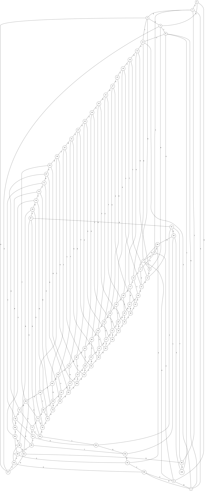

<!DOCTYPE html>
<html lang="en">
<head>
    <meta charset="UTF-8">
    <meta name="viewport" content="width=device-width, initial-scale=1.0">
</head>
<body>

I have taken input for 100 nodes from a csv file and given image of the  graph for your reference

Just clone the repository and run Drone.cpp file

Algorithm :
1.	File Reading and Graph Construction:
Read a CSV file containing edge information.
Construct an adjacency list representation of the graph.
2.	Dijkstra's Algorithm:
function Dijkstra(Graph, src):
    dist[] := array of distances initialized to infinity, size V (number of vertices)
    parent[] := array of parents initialized to -1, size V
    dist[src] := 0

    pq := empty priority queue (min-heap) prioritized by dist[] values
    PriorityQueue.push((src, 0))

    while PriorityQueue is not empty:
        u := PriorityQueue.pop().node

        for each neighbor v of u in Graph:
            new_distance := dist[u] + weight(u, v)
            if new_distance < dist[v]:
                dist[v] := new_distance
                parent[v] := u
                PriorityQueue.push((v, dist[v]))

    return dist[], parent[]
3.	Drone Operations:
o	Execute operations (Takeoff, Survey, ReturnToHome, Land, Failure) using threads.
o	Ensure synchronization such that operations complete in the expected order.

</body>
</html>
